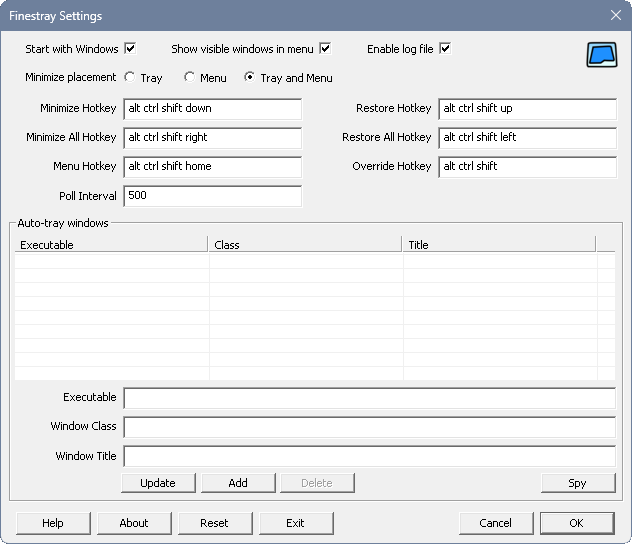

# Finestray

Finestray (pronounced fin-es-tray) is a program that can minimize windows to the system tray area (typically bottom
right corner, formally known as the "notification area") of the Windows desktop. This is useful if you want to have a
window not be visible, and also not show in the taskbar (the usual behavior when a window is minimized) in order to
reduce visual clutter.

> [!NOTE]
> This is a pre-release version, so it will likely have problems. Please report any
> [issues](https://github.com/benbuck/finestray/issues) that you find.

## Installation

There are three standard ways to get Finestray:

1) Using the installer from the [Finestray release page](https://github.com/benbuck/finestray/releases). It's named
   [Finestray-0.4-Win64.exe](https://github.com/benbuck/finestray/releases/download/v0.4/Finestray-0.4-win64.exe).
   Once you have downloaded the file, you will need to run it and go through the prompts to complete the installation.
   After installation completes, Finestray should launch automatically.
2) Using the portable executable from [Finestray release page](https://github.com/benbuck/finestray/releases). The
   portable executable is named
   [Finestray.exe](https://github.com/benbuck/finestray/releases/download/v0.4/Finestray.exe). Place it wherever you
   prefer on your system, and run it from there.
3) Using winget. From a Windows shell (e.g. Command Prompt or Powershell): ```winget install finestray```. After
   installation completes, Finestray should launch automatically.

## Basic Operation

To use Finestray, run it, then use one of the available methods described below to minimize windows to the tray, and
then to restore them to their original position when you want.

The first time Finestray starts (whenever you don't have any saved settings), it should display the
[Settings](#settings) window. You should review the settings, and then press the "OK" button when you are satisfied.

Whenever you run Finestray, it will add an icon for itself to your tray. The icon looks like this:


Finestray supports a number of features to help you control when to minimize windows to the tray and restore them back
to their normal placement:

- **Minimize hotkey**:
  First select a window, then press the configurable hotkey (typically Alt+Ctrl+Shift+Down) to minimize the window to
  the tray.
- **Restore hotkey**:
  Press the configurable hotkey (typically Alt+Ctrl+Shift+Up), and the most recent window that was minimized to tray
  will be restored to its prior location.
- **Minimize all hotkey**:
  Press the configurable hotkey (typically Alt+Ctrl+Shift+Right), and all of the windows will be minimize to the tray.
- **Restore all hotkey**:
  Press the configurable hotkey (typically Alt+Ctrl+Shift+Left), and all of the minimized windows will be restored to
  their prior locations.
- **Menu hotkey**:
  Press the configurable hotkey (typically Alt+Ctrl+Shift+Home) to show the [Context menu](#context-menu).
- **Override modifier**:
  Press and hold the configurable key combination (typically Alt+Ctrl+Shift), and then click on the minimize button of a
  window to minimize it to the tray. See the [Auto-tray settings](#auto-tray-settings) section for additional
  functionality of the override modifier.
- **Tray Icons**:
  If you click on the main tray icon for Finestray itself, it will show the [Settings](#settings) window, and if you
  click it again it will hide the Settings window.

  For any window that has been minimized to an icon in the tray, simply click the icon to restore it to its original
  location.
- **Auto-trays**:
  This feature allows specific windows to be minimized to the tray as soon as they appear or when they are minimized.
  Please see the [Auto-tray Settings](#auto-tray-settings) section for more information.
- **Context menu**:
  For any of the tray icons created by Finestray, including its own, you can right click on it to see the
  [Context menu](#context-menu).

## Context Menu

The context menu is accessible by right clicking on any of the tray icons that Finestray creates, or by activating the
associated hotkey. When shown, the most basic context menu looks like this, but it could have more items depending on
various factors:


From the context menu, you can select one of the menu items:

- **Finestray**:
  Shows a some basic information about Finestray.
- **Settings**:
  Shows the [Settings](#settings) window.
- **Exit**:
  Exits the Finestray application.

Additionally, if your `Minimize placement` is set to `Menu` or `Tray and Menu`, then these menu items may also be
available:

- **List of minimized windows**
  You can click on these items to restore the corresponding window to its original location.
- **Minimize all**
  Minimizes all windows to the tray. This menu item will only be available if there are un-minimized windows listed in
  the context menu.
- **List of non-minimized windows**
  You can click on these items to minimize the corresponding window to the tray.
- **Restore all**
  Restores all minimized windows to their original states. This menu item will only be available if there are minimized
  windows listed in the context menu.

## Settings

To change the default behavior of Finestray, you can modify its settings. To open the Settings window, right click on
any of the icons in the tray the belong to Finestray, and select Settings, or just click once on the main Finestray tray
icon.



The available settings correspond to some of the above features. The settings are:

- **Start with windows**:
  This toggles whether Finestray is launched when you start Windows. If enabled, this creates a shortcut link located in
  your startup folder (`shell:Startup`, typically
  `C:\Users\Your-Name\AppData\Roaming\Microsoft\Windows\Start Menu\Programs\Startup`) which which launches the Finestray
  executable when you log into Windows.
- **Enable log file**:
  This toggles whether Finestray saves logging information to a file or not. If enabled, Finestray first tries to save
  the log file to `%LOCALAPPDATA%\\Finestray\\Finestray.log`, and if that's not possible it saves in the same location
  as the Finestray application.
- **Minimize placement**:
  This controls where to place minimized windows minimized using Finestray. The choices are:
  - **Tray**: the window will get an icon in the tray.
  - **Menu**: the window will get an entry in the [Context menu](#context-menu).
  - **Tray and Menu**: the window will get an icon in the tray and an entry in the [Context menu](#context-menu).
- **Minimize hotkey**:
  This lets you configure the hotkey that is used to minimize a window to the tray. Please see the
  [Modifiers and Hotkeys](#modifiers-and-hotkeys) section for more information.
- **Minimize all hotkey**:
  This lets you configure the hotkey that is used to minimize all window to the tray. Please see the
  [Modifiers and Hotkeys](#modifiers-and-hotkeys) section for more information.
- **Restore hotkey**:
  This lets you configure the hotkey that is used to restore a window to it's original state. Please see the
  [Modifiers and Hotkeys](#modifiers-and-hotkeys) section for more information.
- **Restore all hotkey**:
  This lets you configure the hotkey that is used to restore all windows to their original state. Please see the
  [Modifiers and Hotkeys](#modifiers-and-hotkeys) section for more information.
- **Menu hotkey**:
  This lets you configure the hotkey that is used to show the [Context menu](#context-menu). Please see the
  [Modifiers and Hotkeys](#modifiers-and-hotkeys) section for more information.
- **Override modifier**:
  This lets you configure the modifier that is used to override some Finestray behavior. Please see the
  [Modifiers and Hotkeys](#modifiers-and-hotkeys) section for more information.
- **Auto-trays**:
  This lets you configure the list of auto-tray values that are used to control automatically minimizing specific
  windows to the tray. Items can be added to the list by pressing the "Add" button, removed from the list by pressing
  the "Delete" button, or modified by selecting an item, entering new values into the fields, and pressing the "Update"
  button. Please see the [Auto-Tray Settings](#auto-tray-settings) section for more information.

At the bottom of the Settings dialog are six buttons: Help, About, Reset, Exit, Cancel, and OK:

- **Help**:
  Opens the [Finestray](https://github.com/benbuck/finestray) project web page to display this document.
- **About**:
  Shows a some basic information about Finestray.
- **Reset**:
  Resets all the settings to their default values.
- **Exit**:
  Exits the Finestray application after saving settings.
- **Cancel**:
  Closes the Settings window but does not save settings (settings are restored to their previous values).
- **OK**:
  Closes the Settings window and saves settings.

Settings are automatically stored in a file called "Finestray.json". Finestray first tries to save them to
`%LOCALAPPDATA%\\Finestray\\Finestray.json`, and if that's not possible it saves them in the same location as the
Finestray application.

### Modifiers and Hotkeys

Modifier choices: `alt`, `ctrl`, `shift`, `win`.

Key choices: `back`, `esc`, `f1`, `f2`, `f3`, `f4`, `f5`, `f6`, `f7`, `f8`, `f9`, `f10`, `f11`, `f12`, `f13`, `f14`,
  `f15`, `f16`, `f17`, `f18`, `f19`, `f20`, `f21`, `f22`, `f23`, `f24`, `tab`, `left`, `right`, `up`, `down`, `space`,
  `home`, `end`, `ins`, `del`, letters, numbers, and punctuation.

For the override modifier, you can provide one or more modifiers using spaces in between. For example you could provide
a modifier `alt`, or a modifier `ctrl shift`.

Similarly, for the minimize, minimize all, restore, restore all, and menu hotkeys, you can combine a set of modifiers
together with a single key. So for example, you could combine the modifier `alt win` with the key `esc` to make a hotkey
`alt win esc`. Or you could combine a modifier `ctrl win` with the key `-` to make a hotkey `ctrl win -`.

You can also leave a hotkey or modifier empty or specify `none` to disable it.

### Auto-tray settings

The auto-tray settings are a list of items that each identify a window that you would like to automatically be minimized
to the tray when it opens, and when you minimize it. The complication is that it's often not trivial to identify a
window. Because of this, Finestray provides three possible ways, which can be used in combination, to identify a window:

- **Window class**:
  This value corresponds to the "class" of the window. The class is an internal value, which you can find using the
  [Spy feature](#spy-feature). The class you provide must exactly match the internal value, or you can leave this empty
  if you don't care what the window class is.
- **Executable name**:
  This value corresponds to program the created the window. Provide the full path to the executable, for example
  `C:\Windows\notepad.exe`. This must match (case insensitive) the full path of the executable that owns the window, or
  you  can leave this empty if you don't care which executable created the window.
- **Window title**:
  This typically corresponds to the text at the top of the window in the title bar, or shown in the taskbar. The value
  is provided as a [regular expression](https://en.cppreference.com/w/cpp/regex). If you aren't familiar with regular
  expressions, they are much too complicated to explain here, but just as an example, to match the Notepad window which
  has a title like "Untitled - Notepad", you could use a regular expression like: `.* - Notepad$`. Note that many
  programs dynamically change the title of their window based on various factors, so it may not be easy to pick a
  windows title that always works.

Auto-tray event options:

- **Open**:
  Select this option if you want the specified auto-tray window to minimize to the tray when it opens, or when Finestray
  launches and the window is already open.
- **Minimize**:
  Select this option if you want the specified auto-tray window to minimize to the tray when it is minimized.
- **Open and Minimize**
  Select this option if you want the specified auto-tray window to minimize to the tray both when it opens, and when it
  is minimized.

Tray persistence options (this has no effect if your Minimize Placement setting is "Menu"):

- **Never**:
  Select this option if you want the specified tray icon to disappear when the auto-tray window is restored.
- **Always**:
  Select this option if you want the specified tray icon to remain when the auto-tray window is restored.

Note that the Override modifier also has an effect on auto-trays. It overrides the normal auto-tray behavior. For
example, if you are holding down the override modifier keys when a window is created, it will prevent the normal
auto-tray behavior from happening. If you minimize an auto-tray window while holding the override modifier keys, the
window will minimize the standard way instead of to the tray.

### Spy feature

If you want to use the Auto-tray feature but don't know the executable, class, or title of a window, or would just like
some help filling those values, you can use the Spy feature. To use it, first open the [Settings](#settings) window,
find the crosshair icon next to the text that says "Spy (drag this):", and use your mouse to drag that icon onto the
window that you want to obtain the executable, class, and title of. As you drag the crosshair around, the settings
window should be updated with information about each window you move it over, and when you release the mouse button then
the crosshair icon will return to its original position, and the values in the settings should stay filled in with
whatever window you last dragged on top of. You can modify the values if you like, or leave them alone, and then press
the "Add" button to create a new Auto-tray item for that window.

If the Spy feature doesn't work for you, alternatively you can use another tool like
[Window Spy](https://amourspirit.github.io/AutoHotkey-Snippit/WindowSpy.html) or
[Spy++](https://learn.microsoft.com/en-us/visualstudio/debugger/introducing-spy-increment) which provide more advanced
window identification features.

## Limitations

Unfortunately, Finestray can not currently minimize all windows to the tray. Some software creates windows that do not
adhere to the typical behavior for minimizing. For example, apps obtained from the Windows Store (also known as UWP
apps) may not be compatible with Finestray.

## Legal

Copyright &copy; 2020 [Benbuck Nason](<https://github.com/benbuck>)

Finestray is distributed under the [Apache License, Version 2.0](LICENSE).

Please see the [privacy policy](PRIVACY.md) for information about privacy concerns.

Finestray uses the [cJSON library](https://github.com/DaveGamble/cJSON) for JSON parsing.

Finestray uses some [Google Noto Emoji](https://github.com/googlefonts/noto-emoji) for image artwork.
